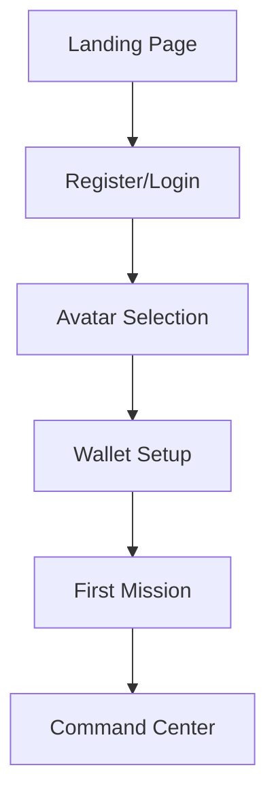
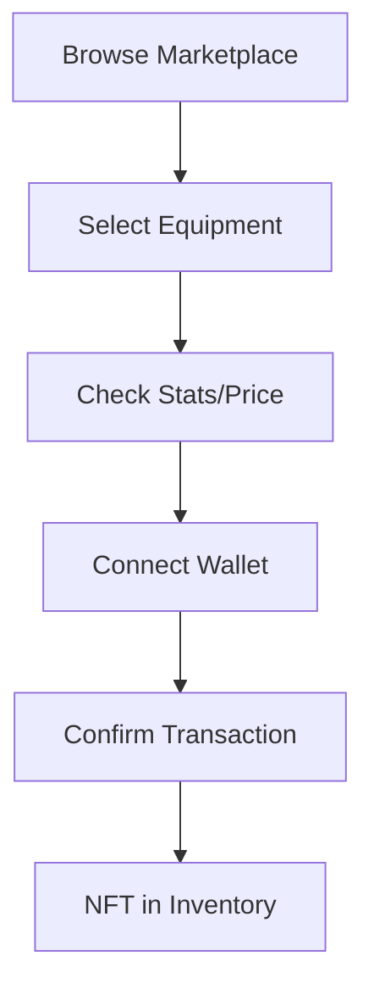
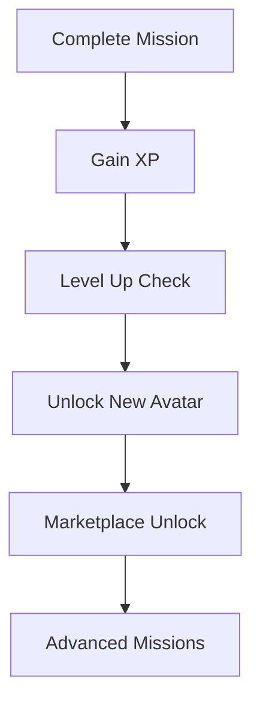

# 📱 Mockups & Screenshots CYBA Universe

## 📋 Collection Visuelle

Ce dossier contient les mockups, screenshots et prévisualisations de **CYBA Universe**, la plateforme gaming Web3 de formation en cybersécurité.

## 🎮 Interface Gaming Screenshots

### **1. Hero Landing Page**
*Capture : Page d'accueil avec animation cyber*
- **Résolution** : 1920x1080 (Desktop), 768x1024 (Tablet), 375x667 (Mobile)
- **Éléments** : Logo animé, gradients cyber, call-to-action gaming
- **Style** : Glass morphism, effets glow cyan/purple

### **2. Avatar Selector Interface**
*Capture : Sélecteur d'avatars lors de l'inscription*
- **Vue** : 8 avatars disponibles avec stats preview
- **Interactions** : Hover effects, unlock conditions, descriptions lore
- **Gaming Elements** : Stats bars, rarity indicators, 3D preview

### **3. Command Center Dashboard**
*Capture : Dashboard principal utilisateur*
- **Sections** : Progression gaming, missions actives, leaderboard
- **Widgets** : XP progression, CYBA balance, achievements récents
- **Style** : Cyber command center, multiple écrans, données temps réel

### **4. Marketplace P2P**
*Capture : Interface trading équipements NFT*
- **Catalogue** : Grid équipements avec filtres rareté
- **Details** : Stats boost, prix CYBA, historique trading
- **Web3** : Wallet connection, transaction status, gas fees

### **5. Avatar Profile**
*Capture : Page profil avatar avec équipements*
- **Avatar 3D** : Rendu avatar avec tous équipements
- **Inventaire** : 10 slots équipements + stats totales
- **Progression** : XP curve, achievements, combat stats

## 📊 Data Visualizations

### **Analytics Dashboard Admin**
```yaml
Métriques Affichées:
├── 📈 Volume trading journalier
├── 👥 Utilisateurs actifs
├── 💎 CYBA tokens en circulation
├── 🎭 NFT avatars mintés
├── ⚔️ Équipements tradés
└── 🏆 Leaderboard global
```

### **Economic Health Dashboard**
```yaml
KPIs Blockchain:
├── 💰 TVL (Total Value Locked)
├── 🔄 Transaction volume
├── ⛽ Gas optimization
├── 🏪 Marketplace activity
├── 💎 Staking ratio
└── 🚨 Security alerts
```

## 🎨 Design System Mockups

### **Component Library**
- **Buttons Gaming** : Gradients, hover effects, disabled states
- **Cards Glass** : Various sizes, content types, animations
- **Form Controls** : Inputs, selects, checkboxes cyber theme
- **Navigation** : Header, sidebar, breadcrumbs, pagination
- **Modals** : Success, error, confirmation, loading states

### **Color Schemes**
```css
/* Light Mode (Optional) */
.theme-light {
  --bg-primary: #F8FAFC;
  --bg-secondary: #F1F5F9;
  --text-primary: #0F172A;
  --accent-cyber: #06B6D4;
}

/* Dark Mode (Default) */
.theme-dark {
  --bg-primary: #0F172A;
  --bg-secondary: #1E293B;
  --text-primary: #F1F5F9;
  --accent-cyber: #67E8F9;
}

/* Gaming Mode (Premium) */
.theme-gaming {
  --bg-primary: #000000;
  --bg-secondary: #1A1A2E;
  --text-primary: #EEEDFF;
  --accent-cyber: #00FFFF;
  --glow-intensity: 0.8;
}
```

## 📱 Responsive Design

### **Mobile First Approach**
```yaml
Mobile (375px+):
├── 📱 Avatar selector: 2 columns
├── 📊 Dashboard: Stacked widgets
├── 🏪 Marketplace: List view
├── ⚡ Navigation: Hamburger menu
└── 🎮 Gaming: Touch optimized

Tablet (768px+):
├── 📱 Avatar selector: 3-4 columns
├── 📊 Dashboard: 2 column grid
├── 🏪 Marketplace: Grid 2x3
├── ⚡ Navigation: Collapsed sidebar
└── 🎮 Gaming: Hybrid touch/cursor

Desktop (1024px+):
├── 📱 Avatar selector: Full 4x2 grid
├── 📊 Dashboard: 3-4 column layout
├── 🏪 Marketplace: Full grid view
├── ⚡ Navigation: Full sidebar
└── 🎮 Gaming: Full gaming experience
```

## 🎬 Animation Previews

### **Micro-Interactions**
- **Button Hover** : Transform scale, glow intensity, gradient shift
- **Card Reveal** : Slide up with blur fade-in
- **Avatar Switch** : 3D flip transition with stats animation
- **XP Gain** : Progress bar fill with number counting
- **NFT Mint** : Sparkle effect with success celebration

### **Page Transitions**
```css
/* Gaming page transitions */
.page-enter {
  opacity: 0;
  transform: translateY(20px) scale(0.95);
}

.page-enter-active {
  opacity: 1;
  transform: translateY(0) scale(1);
  transition: all 300ms ease-out;
}

.page-exit {
  opacity: 1;
  transform: translateY(0) scale(1);
}

.page-exit-active {
  opacity: 0;
  transform: translateY(-20px) scale(1.05);
  transition: all 200ms ease-in;
}
```

## 🎯 User Flow Mockups

### **1. Onboarding Journey**


### **2. Trading Flow**


### **3. Progression Path**


## 🖼️ High-Fidelity Mockups

### **Avatar Selection Modal**
```yaml
Specifications:
├── 📐 Dimensions: 800x600px modal
├── 🎨 Background: Glass morphism blur
├── 🎭 Avatars: 8 cards in 4x2 grid
├── 📊 Stats: Radar chart preview
├── 🔒 Unlock: Progress bars with levels
├── 💎 Price: CYBA cost display
└── ✨ Animations: Hover reveal, selection glow
```

### **Marketplace Grid**
```yaml
Specifications:
├── 📐 Layout: Responsive masonry grid
├── 🏷️ Filters: Rarity, slot, price range
├── 🔍 Search: Real-time filtering
├── 📊 Sort: Price, rarity, date added
├── 💰 Price: CYBA + USD estimate
├── ⭐ Ratings: Community ratings
└── 🎮 Preview: 3D equipment viewer
```

## 📊 Performance Mockups

### **Loading States**
- **Skeleton Screens** : Content placeholders pendant chargement
- **Progressive Loading** : Assets critiques en premier
- **Error States** : Messages d'erreur gaming themed
- **Empty States** : Illustrations encourageant action

### **Optimization Previews**
```yaml
Métriques Performance:
├── ⚡ Page Load: <3s (desktop), <5s (mobile)
├── 🎨 First Paint: <1.5s
├── 🎮 Interactive: <2s
├── 📱 Mobile Score: 90+ Lighthouse
├── 🖥️ Desktop Score: 95+ Lighthouse
└── ♿ Accessibility: AA WCAG compliance
```

## 🎨 Style Guide Mockups

### **Typography Scales**
```css
/* Gaming typography hierarchy */
.text-hero { font-size: 4rem; font-weight: 900; } /* 64px */
.text-title { font-size: 2.5rem; font-weight: 800; } /* 40px */
.text-heading { font-size: 1.875rem; font-weight: 700; } /* 30px */
.text-subheading { font-size: 1.5rem; font-weight: 600; } /* 24px */
.text-body { font-size: 1rem; font-weight: 400; } /* 16px */
.text-caption { font-size: 0.875rem; font-weight: 500; } /* 14px */
.text-small { font-size: 0.75rem; font-weight: 400; } /* 12px */
```

### **Spacing System**
```css
/* Spacing scale gaming */
.space-xs { margin: 0.25rem; } /* 4px */
.space-sm { margin: 0.5rem; } /* 8px */
.space-md { margin: 1rem; } /* 16px */
.space-lg { margin: 1.5rem; } /* 24px */
.space-xl { margin: 2rem; } /* 32px */
.space-2xl { margin: 3rem; } /* 48px */
.space-3xl { margin: 4rem; } /* 64px */
```

## 🔗 Assets Links

### **Mockup Resources**
- **Figma Designs** : [CYBA Design System](https://figma.com/cyba-universe)
- **Prototype Interactive** : [InVision Prototype](https://invision.com/cyba-prototype)
- **Style Guide** : [Storybook Components](https://storybook.cyba-universe.com)
- **Asset Downloads** : [Brand Kit ZIP](https://assets.cyba-universe.com)

### **Design Tools**
```yaml
Création Mockups:
├── 🎨 Figma: Design system principal
├── 📐 Sketch: Assets vectoriels
├── 🖼️ Photoshop: Rendus réalistes
├── 🎬 After Effects: Animations
├── 🎮 Blender: 3D avatar previews
└── 📱 Principle: Micro-interactions
```

## 📸 Screenshot Specifications

### **Formats & Résolutions**
```yaml
Screenshots Standards:
├── 🖥️ Desktop: 1920x1080, 2560x1440
├── 📱 Mobile: 375x667, 414x896, 390x844
├── 📟 Tablet: 768x1024, 834x1194
├── 🖼️ Social: 1200x630 (OpenGraph)
├── 📰 Press: 1920x1080 (high quality)
└── 🎮 Gaming: 16:9 ratio optimized
```

### **Capture Guidelines**
- **Lighting** : Consistent avec design system
- **Content** : Données réalistes, pas lorem ipsum
- **State** : Interactive states (hover, active, focus)
- **Context** : Montrer usage réel de la feature
- **Quality** : High DPI, compression optimisée

---

## 🎯 Usage & Distribution

### **Press Kit**
Mockups inclus dans press kit pour :
- **🗞️ Articles** média spécialisé
- **🎤 Présentations** conférences
- **🤝 Partnerships** démonstrations
- **💼 Investisseurs** pitch decks
- **📚 Documentation** technique

### **Community Usage**
- **✅ Autorisé** : Partage communautaire avec attribution
- **✅ Reviews** : Critiques et analyses
- **✅ Educational** : Contenu éducatif non-commercial
- **❌ Interdit** : Usage commercial sans autorisation
- **❌ Modification** : Altération sans permission

---

*Ces mockups illustrent la vision gaming Web3 de CYBA Universe. Contactez design@cyba-universe.com pour assets customs ! 🎨*